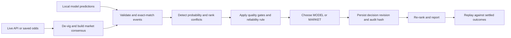

# SignalJudge

**Auditable reconciliation when a sports model and the live market disagree.**

SignalJudge takes independently produced sports predictions, fetches or loads bookmaker odds for the same events, removes bookmaker margin, measures the quality of both signals, explicitly chooses `MODEL`, `MARKET`, or a safety-first `ABSTAIN`, and emits a reconciled ranking with a tamper-evident audit trail.

It is deliberately deterministic: the numerical decision is reproducible, testable, and never delegated to an LLM.

> This is an engineering assessment and probability-analysis demonstration, not betting advice. The bundled replay data is clearly labelled synthetic and is not presented as historical fact.

## Quick start

Only Python 3.9+ is required. The core project has no mandatory third-party runtime dependencies.

```bash
git clone https://github.com/Abp0101/signaljudge.git
cd signaljudge
make demo
```

The command runs two odds snapshots, writes durable state, evaluates both blind baselines, verifies the audit chain, and generates:

- `artifacts/report.html` — interactive Decision Replay Lab
- `artifacts/latest_ranking.json` — reconciled ranking and rationale
- `artifacts/evaluation.json` — model-only, market-only and agent metrics
- `artifacts/audit.json` — run history and audit verification

Open the dashboard directly, or serve it locally:

```bash
PYTHONPATH=src python3 -m signaljudge serve
# http://127.0.0.1:8765/report.html
```

## Interactive application

SignalJudge also ships as a local application. It preserves the same tested
reconciliation service and SQLite audit state while adding sport selection, current
fixtures, sorting, filtering, refresh controls, and explicit live/cache/model-source
status.

```bash
export THE_ODDS_API_KEY='your-key'
PYTHONPATH=src python3 -m signaljudge app --open
# http://127.0.0.1:8765/
```

Or use `make app`. The application offers two modes:

- **Live markets** fetches current odds for MLB, NBA, or the English Premier
  League. It reads independent predictions from `predictions/<sport_key>.json`.
- **Assessment demo** runs the bundled, reproducible two-snapshot fixture without
a network connection or API key.

For local convenience, `app` also checks `.env` when the variable is not already
exported. It parses only a literal `THE_ODDS_API_KEY` assignment; it does not execute
the file, expand shell expressions, or expose the value to the browser. Select a
different file with `--env-file`.

Every provider fixture remains visible. If its exact event ID has no independent
prediction, the row is labelled `NO_PREDICTION`; SignalJudge never fabricates a
model score from the bookmaker market. Use the controls to sort by rank, kickoff,
final probability, or disagreement size and to filter model wins, market wins,
conflicts, abstentions, and unavailable predictions.

The application caches each sport/region response for five minutes and rate-limits
manual provider refreshes to one every 30 seconds. The screen distinguishes
provider `LIVE`, recent degraded `CACHE`, and synthetic `DEMO` data. “Live” means
the latest provider snapshot, not necessarily a match currently in play.

Expected replay result:

```text
Material conflicts: 6
Model wins: 2 | Market wins: 6
MODEL  Brier=0.227  Accuracy=75.0%
MARKET Brier=0.170  Accuracy=87.5%
AGENT  Brier=0.145  Accuracy=100.0%
Blind-source errors corrected: 3
Audit chain: VALID (16 entries)
```

These figures describe only the documented eight-event synthetic fixture. They demonstrate behaviour; they are not a claim of real-world predictive performance.

## What the agent does



Every run follows and records the same plan:

```text
LOAD → FETCH → VALIDATE → MATCH → COMPARE → DECIDE → PERSIST → RANK → REPORT
```

The live provider can fall back to its last-known-good cache after transient failure, but only for 15 minutes by default. Cached payloads are marked `degraded`, evaluated against the current time, and never silently described as live.

## Decision rule

### 1. Fair market probability

For each bookmaker and outcome:

```text
raw implied probability = 1 / decimal odds
fair probability = raw outcome probability / sum(raw probabilities in that book's market)
```

SignalJudge then rejects isolated bookmaker outliers and uses the median fair probability across the remaining books.

### 2. Reliability

Model reliability considers historical accuracy, validation sample size, calibration error, prediction age, and whether the prediction is outside the model's validated distribution.

Market reliability considers valid-book coverage, odds freshness, cross-book dispersion, and rejected outliers.

```text
model weight  = model reliability × applicable safety gate
market weight = market reliability × applicable safety gate
winner        = source with the larger weight

reconciled probability =
    (model weight × model probability + market weight × fair market probability)
    / (model weight + market weight)
```

Safety gates take precedence when:

- too few valid books or stale prices make the market unreliable;
- the model marks an event out of distribution; or
- a material movement occurs coherently across at least 60% of common books.

If the model and market are both outside their safe operating conditions, SignalJudge abstains instead of forcing a misleading winner. A missing or invalid market also produces an explicit `UNRESOLVED` audit record rather than silently dropping the prediction.

The winner is always explicit even though the final probability retains discounted information from the losing source. `decision_confidence` describes confidence in the source choice; it is intentionally separate from the predicted outcome probability.

### 3. Material disagreement

A conflict is material when either:

- model and market probabilities differ by at least 10 percentage points; or
- their batch ranks differ by at least three positions.

Thresholds are versioned configuration in `DecisionConfig`, not hidden constants in the UI.

## Demonstrated corrections

The replay includes both failure directions:

- **Model-only failure:** Atlanta's model score remains 82%, but fair market probability moves coherently from 62% to 42%. SignalJudge selects the market and moves the reconciled probability below 50%.
- **Market-only failure:** Chicago's market probability is 43%, but the quotes are four hours stale and one 78% bookmaker outlier is rejected. SignalJudge selects the historically reliable model.
- **Model operating-boundary failure:** Toronto's model prediction is marked out of distribution, so the fresh market signal wins.

Settled fixture outcomes are loaded only after decisions are produced. This prevents temporal leakage into the rule.

## Use your own snapshot

Prediction files use schema version 1:

```json
{
  "schema_version": 1,
  "predictions": [{
    "event_id": "provider-event-id",
    "sport_key": "baseball_mlb",
    "commence_time": "2026-08-17T18:00:00Z",
    "home_team": "Home team",
    "away_team": "Away team",
    "selection": "Home team",
    "model_probability": 0.67,
    "historical_accuracy": 0.71,
    "historical_sample_size": 240,
    "calibration_error": 0.04,
    "generated_at": "2026-08-17T09:00:00Z",
    "model_version": "my-model-1"
  }]
}
```

The `event_id`, sport, teams and start time must match. SignalJudge refuses ambiguous identity rather than fuzzy-matching the wrong event. Soccer predictions may select the home team, away team or `Draw`; bookmaker margin is removed across all three outcomes.

```bash
PYTHONPATH=src python3 -m signaljudge run \
  --predictions path/to/predictions.json \
  --odds path/to/odds.json \
  --previous-odds path/to/previous-odds.json
```

CLI exit code `3` means no prediction could be safely reconciled; exit code `4` means audit verification failed. The JSON output is still written so operators can inspect every abstention and rationale.

## Live odds

The adapter targets [The Odds API V4](https://the-odds-api.com/liveapi/guides/v4/). V4 requires the key as an `apiKey` query parameter, so SignalJudge never logs request URLs or chains provider exceptions that could expose it. Obtain a key, prepare an independent prediction file containing the provider's current event IDs, then run:

```bash
cp .env.example .env
# Export the value in your shell; .env files are not implicitly executed.
export THE_ODDS_API_KEY='your-key'

PYTHONPATH=src python3 -m signaljudge live \
  --predictions path/to/current_predictions.json \
  --sport-key baseball_mlb \
  --serve
```

Live mode writes `artifacts/live-ranking.json` and `artifacts/live-report.html`. The dashboard identifies every game with both teams, kickoff time, selected outcome, opponent, model probability, fair market probability and reconciled probability.

Supported live configurations are MLB and NBA with US bookmakers, plus the English Premier League with UK bookmakers. Region defaults are sport-aware and can be overridden from the fixed `us`, `uk`, `eu` or `au` allowlist. For EPL:

```bash
PYTHONPATH=src python3 -m signaljudge live \
  --predictions path/to/epl_predictions.json \
  --sport-key soccer_epl \
  --region uk \
  --report artifacts/epl-live.html \
  --serve
```

The hostname, sport keys and bookmaker regions are allowlisted. Requests have response-size limits, timeouts, bounded exponential retry, `Retry-After` handling, quota metadata and last-known-good fallback. Live predictions must remain independently produced; SignalJudge never derives the model score from bookmaker odds.

For the application, name the prediction file after its sport key:

```text
predictions/baseball_mlb.json
predictions/basketball_nba.json
predictions/soccer_epl.json
```

The sport selector reports each adapter as `ready`, `missing`, or `invalid` before
the first market fetch. See `predictions/README.md` for the adapter contract.

## State and auditability

SQLite stores runs, raw snapshots, decisions, source metrics and links between revisions. State is scoped by sport, model version and market type. Processing identical complete input is idempotent; the hash includes every prediction field, current and previous snapshots, mode, policy version and configuration.

Decisions are append-only. Each audit hash is:

```text
SHA-256(previous audit hash + canonical decision JSON)
```

Decision hashes are summarized by a second run-level chain covering raw snapshot evidence, warnings, run status, configuration-derived content hash and ordered decisions. Changing source evidence, a decision or run metadata breaks verification. This is tamper-evident, not a substitute for signatures or access-controlled immutable storage.

## Tests

```bash
make check
```

The suite covers:

- decimal and American odds conversion;
- vig removal and market consensus;
- isolated outlier rejection and stale prices;
- coherent multi-book movement;
- unsafe input rejection and provider allowlisting;
- three-or-more material conflicts;
- both explicit source winners;
- state revision and idempotency;
- audit-chain verification;
- run-envelope verification, including raw-snapshot tampering;
- safe abstention and explicit unresolved predictions;
- rolling batches containing previously unseen events;
- stale-cache rejection and live/cache provenance;
- dashboard script-injection resistance;
- localhost Host-header and same-origin API enforcement;
- application response caching and refresh throttling;
- live fixtures remaining visible when predictions are unavailable;
- fixture, opponent and kickoff context in replay and live dashboards;
- UK EPL region defaults and three-outcome soccer normalization;
- migration from the original SQLite schema;
- objective correction of model-only and market-only failures.

CI runs the suite and full demo on Python 3.9 and 3.12.

## Repository map

```text
src/signaljudge/
  provider.py      hardened live API client
  odds.py          conversion, de-vig, consensus, movement
  decision.py      reliability rule and rationale
  service.py       stateful workflow orchestration
  state.py         SQLite persistence and audit chain
  evaluation.py    proper scoring rules and baselines
  report.py        dependency-free replay and live dashboards
  application.py   secure localhost API and application orchestration
  web_assets.py    dependency-free interactive operator console
data/demo/         labelled synthetic two-snapshot fixture
predictions/       independent per-sport live prediction adapters
tests/             unit, security and end-to-end tests
```

See [ARCHITECTURE.md](ARCHITECTURE.md) for deeper trade-offs and [SECURITY.md](SECURITY.md) for the threat model.

## Limitations and next steps

With more time I would:

1. evaluate on a large, time-stamped real historical dataset and tune thresholds only on a separate training split;
2. calibrate source reliability by league and confidence bucket using rolling Brier scores;
3. support simultaneous full-outcome distributions, spreads and totals without conflating probability spaces;
4. replace SQLite with PostgreSQL for concurrent writers and sign audit checkpoints in external immutable storage;
5. add schema-contract monitoring for the odds provider and alerting for calibration drift;
6. deploy the dashboard behind authenticated HTTPS rather than exposing a local demonstration server.

The deliberately bounded scope is head-to-head outcome reconciliation for MLB, NBA and EPL. EPL supports home, away and draw selections while preserving one ranked prediction per event. The project prioritizes a complete, defensible system over unsupported market breadth.

## Contributing

Create a branch, run `make check`, and include a test for any decision-rule change. A rule change must update its version and document the expected calibration or reliability impact.
