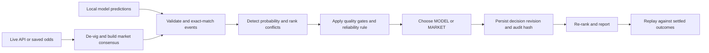

# SignalJudge

**Auditable reconciliation when a sports model and the live market disagree.**

[](https://github.com/Abp0101/signaljudge/actions/workflows/ci.yml)

SignalJudge takes independently produced sports predictions, fetches or loads bookmaker odds for the same events, removes bookmaker margin, measures the quality of both signals, explicitly chooses `MODEL`, `MARKET`, or a safety-first `ABSTAIN`, and emits a reconciled ranking with a tamper-evident audit trail.

It is deliberately deterministic: the numerical decision is reproducible, testable, and never delegated to an LLM.

> This is an engineering assessment and probability-analysis demonstration, not betting advice. The bundled replay data is clearly labelled synthetic and is not presented as historical fact.

## Quick start

Only Python 3.9+ is required. The core project has no mandatory third-party runtime dependencies.

```bash
git clone https://github.com/Abp0101/signaljudge.git
cd signaljudge
make demo
```

The command runs two odds snapshots, writes durable state, evaluates both blind baselines, verifies the audit chain, and generates:

- `artifacts/report.html` — interactive Decision Replay Lab
- `artifacts/latest_ranking.json` — reconciled ranking and rationale
- `artifacts/evaluation.json` — model-only, market-only and agent metrics
- `artifacts/audit.json` — run history and audit verification

Expected deterministic result:

```text
Material conflicts: 6
Model wins: 2 | Market wins: 6
MODEL  Brier=0.227  SelectionAccuracy=75.0%
MARKET Brier=0.170  SelectionAccuracy=87.5%
AGENT  Brier=0.145  SelectionAccuracy=100.0%
Blind-source errors corrected: 3
Audit chain: VALID (16 entries)
```

These figures describe only the documented eight-event synthetic fixture. They
demonstrate the required behaviour and are not a claim of real-world predictive
performance.

Open the dashboard directly, or serve it locally:

```bash
PYTHONPATH=src python3 -m signaljudge serve
# http://127.0.0.1:8765/report.html
```

For a time-constrained review: run `make demo`, move the report timeline between
the opening and latest snapshots, inspect the three blind-source corrections, and
confirm the audit badge. `make check` then exercises the same invariants in CI.

## Assessment coverage

| Brief requirement | Verifiable evidence |
| --- | --- |
| Local model or file plus live public odds; compare the same events and identify at least three material disagreements | The live application combines the odds-independent EPL artifact with The Odds API using exact event identity. The offline acceptance fixture produces six material conflicts. |
| Explicitly choose a source, explain every choice, and correct a failure caused by blindly trusting either source | Policy `2.2` records `MODEL`, `MARKET`, or `ABSTAIN`, structured reason codes, weights, and rationale. Settled-outcome replay corrects both a model-only and a market-only failure. |
| Maintain batch state, update confidence with new data, and output a ranked full audit trail | Two snapshots update market movement, source confidence, previous probability, winner, and rank in SQLite. JSON and HTML expose every score and rationale; decision and run hash chains verify 16 replay entries. |

Live mode proves the external integration; the deterministic replay proves required
decision branches without depending on network availability or changing bookmaker
prices. Both paths use the same reconciliation service.

## Interactive application

SignalJudge also ships as a local application. It preserves the same tested
reconciliation service and SQLite audit state while adding sport selection, current
fixtures, sorting, filtering, refresh controls, and explicit live/cache/model-source
status.

```bash
export THE_ODDS_API_KEY='your-key'
PYTHONPATH=src python3 -m signaljudge app --open
# http://127.0.0.1:8765/
```

Or use `make app`. The application offers two modes:

- **Live markets** fetches current odds for MLB, NBA, or the English Premier
  League. EPL fixtures are automatically scored by the bundled, independently
  trained rating model. An exact prediction file can override a model artifact.
- **Assessment demo** runs the bundled, reproducible two-snapshot fixture without
  a network connection or API key.

### Why NBA and MLB show `model missing`

The live provider supports NBA and MLB fixtures and odds, but this repository does
not ship trained models for those sports. No authorised, reproducible NBA or MLB
results pipeline was selected and validated within the assessment scope. SignalJudge
therefore keeps the fixtures visible and explicitly reports `model missing` instead of
deriving a supposedly independent score from bookmaker prices or inventing confidence
values. This is an intentional fail-closed state, not an API or application failure.

An independent model can be added without changing the reconciliation engine by
providing `predictions/basketball_nba.json`, `predictions/baseball_mlb.json`, or a
validated sport-specific artifact. The next-step plan is to train separate models with
sport-appropriate features and chronological holdout metrics.

For local convenience, `app` also checks `.env` when the variable is not already
exported. It parses only a literal `THE_ODDS_API_KEY` assignment; it does not execute
the file, expand shell expressions, or expose the value to the browser. Select a
different file with `--env-file`.

Every provider fixture remains visible. If its exact event ID has no independent
prediction, the row is labelled `NO_PREDICTION`; SignalJudge never fabricates a
model score from the bookmaker market. Use the controls to sort by rank, kickoff,
final probability, or disagreement size and to filter model wins, market wins,
conflicts, abstentions, and unavailable predictions.

The application caches each sport/region response for five minutes and rate-limits
manual provider refreshes to one every 30 seconds. The screen distinguishes
provider `LIVE`, recent degraded `CACHE`, and synthetic `DEMO` data. “Live” means
the latest provider snapshot, not necessarily a match currently in play.

## Independent EPL model

Live EPL predictions come from `models/soccer_epl.model.json`, a local three-way
Elo model trained only on match results. It never receives bookmaker names, prices,
implied probabilities, or market movements. The inference boundary accepts only an
event ID, sport, teams and kickoff time.

The reproducible trainer downloads Premier League and Championship results for
2024/25 and 2025/26 from [Football-Data](https://www.football-data.co.uk/englandm.php).
Although those CSVs contain betting columns, the trainer allowlists and parses only:

```text
Date, HomeTeam, AwayTeam, FTHG, FTAG, FTR
```

Training uses a chronological 70% training split, 15% tuning split and final 15%
untouched test split. The committed artifact records every source URL, SHA-256 hash,
row count, chosen parameters, training cutoff and validation result:

```text
Three-way accuracy: 48.2%
Multiclass Brier:    0.208
Log loss:            1.036
Calibration error:  2.8%
Untouched test set:  280 matches
```

These are measured historical holdout results, not a claim of profitability or
future performance. Regenerate the artifact with:

```bash
make train-models
```

Manual files in `predictions/<sport_key>.json` take precedence, allowing a stronger
external model to be connected without changing the reconciliation engine. The NBA
and MLB availability decision is explained above and remains visible in the UI.

## Engineering evolution

The project was developed in deliberate passes. Each pass addressed a weakness that
would otherwise make the assessment difficult to trust or operate:

| Earlier weakness | Why it mattered | Improvement made |
| --- | --- | --- |
| The first reliable evidence path was fixture-driven and CLI-first | A synthetic replay proves behaviour, not that the provider and operator workflow work end to end | Corrected and hardened the live V4 adapter, then added an interactive application while retaining the offline demo as a deterministic acceptance test |
| Provider input and failures were an external trust boundary | Malformed responses, unbounded payloads, retry storms, or secret-bearing URLs could undermine the run | Added schema validation, allowlisted sports/regions/hostname, response limits, timeouts, bounded retry with `Retry-After`, quota metadata, sanitized errors, and an explicitly degraded last-known-good cache |
| A decision could be forced even when neither source was safe | “Always choose something” creates false confidence | Added `ABSTAIN` and `UNRESOLVED` outcomes plus gates for stale/thin markets, out-of-distribution predictions, provider degradation, and insufficient reliability |
| A decision-level audit did not fully bind the surrounding run evidence | Changing a raw snapshot or denormalised ranking could make stored evidence disagree with the explanation | Persisted raw snapshots and revisions, expanded idempotent content hashes, hardened transactional writes and schema migration, and added a run-level chain over each ordered decision chain |
| The early output emphasised a selection more than its fixture | A team name without its opponent, kickoff, sport, or data origin is not operationally useful | Added complete fixture identity, kickoff and opponent context, source status, sorting, filtering, refresh controls, and visible `NO_PREDICTION` states |
| Static prediction files demonstrated reconciliation but not a connected trained model | It left model provenance and market independence implicit | Added a reproducible EPL Elo trainer, a versioned validated artifact, chronological holdout metrics, exact provider aliases, and an inference boundary that cannot read odds |
| A single-source baseline could look adequate without settled outcomes | The key failure case in the brief would be asserted rather than measured | Added replay evaluation against outcomes using accuracy, Brier score, and explicit cases corrected relative to both blind baselines |

The result is intentionally a bounded system: live mode demonstrates real integration,
while the offline replay demonstrates decision behaviour repeatably. Neither is used to
make unsupported claims about future profitability.

## What the agent does

Here, **agent** means a bounded autonomous decision controller, not an LLM. It
observes two independent signals, executes a versioned plan, maintains state, chooses
an action, and records why. Keeping numerical source selection deterministic makes the
same complete input produce the same auditable decision.



Every run follows and records the same plan:

```text
LOAD → FETCH → VALIDATE → MATCH → COMPARE → DECIDE → PERSIST → RANK → REPORT
```

The live provider can fall back to its last-known-good cache after transient failure, but only for 15 minutes by default. Cached payloads are marked `degraded`, evaluated against the current time, and never silently described as live.

## Decision rule

### 1. Fair market probability

For each bookmaker and outcome:

```text
raw implied probability = 1 / decimal odds
fair probability = raw outcome probability / sum(raw probabilities in that book's market)
```

SignalJudge then rejects isolated bookmaker outliers and uses the median fair probability across the remaining books.

### 2. Reliability

Model reliability considers historical accuracy, validation sample size, calibration
error, inference age, underlying source-data age, and whether the prediction is outside
the model's validated distribution. A model artifact therefore does not become “fresh”
merely because inference ran against a new market snapshot.

Market reliability considers valid-book coverage, odds freshness, cross-book dispersion, and rejected outliers.

Both values are versioned **policy scores**, not claimed probabilities of correctness.
The market score has an explicit `0.72` ceiling in `DecisionConfig`; fitting that ceiling
and the remaining coefficients requires a larger chronological settled-outcome corpus.

```text
model weight  = model reliability × applicable safety gate
market weight = market reliability × applicable safety gate
winner        = source with the larger weight

reconciled probability =
    (model weight × model probability + market weight × fair market probability)
    / (model weight + market weight)
```

Safety gates take precedence when:

- too few valid books or stale prices make the market unreliable;
- the model marks an event out of distribution; or
- a material movement occurs coherently across at least 60% of common books.

If the model and market are both outside their safe operating conditions, SignalJudge abstains instead of forcing a misleading winner. A missing or invalid market also produces an explicit `UNRESOLVED` audit record rather than silently dropping the prediction.

The winner is always explicit even though the final probability retains discounted information from the losing source. `decision_confidence` describes confidence in the source choice; it is intentionally separate from the predicted outcome probability.

### 3. Material disagreement

A conflict is material when either:

- model and market probabilities differ by at least 10 percentage points; or
- their batch ranks differ by at least three positions.

Thresholds are versioned configuration in `DecisionConfig`, not hidden constants in the UI.

## Demonstrated corrections

The replay includes both failure directions:

- **Model-only failure:** Atlanta's model score remains 82%, but fair market probability moves coherently from 62% to 42%. SignalJudge selects the market and moves the reconciled probability below 50%.
- **Market-only failure:** Chicago's market probability is 43%, but the quotes are four hours stale and one 78% bookmaker outlier is rejected. SignalJudge selects the historically reliable model.
- **Model operating-boundary failure:** Toronto's model prediction is marked out of distribution, so the fresh market signal wins.

Settled fixture outcomes are loaded only after decisions are produced. This prevents temporal leakage into the rule.

## Use your own snapshot

Prediction files use schema version 1:

```json
{
  "schema_version": 1,
  "predictions": [{
    "event_id": "provider-event-id",
    "sport_key": "baseball_mlb",
    "commence_time": "2026-08-17T18:00:00Z",
    "home_team": "Home team",
    "away_team": "Away team",
    "selection": "Home team",
    "model_probability": 0.67,
    "historical_accuracy": 0.71,
    "historical_sample_size": 240,
    "calibration_error": 0.04,
    "generated_at": "2026-08-17T09:00:00Z",
    "source_data_at": "2026-08-16T23:59:59Z",
    "model_version": "my-model-1"
  }]
}
```

The `event_id`, sport, teams and start time must match. `source_data_at` is optional for
external files and records when the newest underlying model feature was available; when
present it must not be later than `generated_at`. SignalJudge refuses ambiguous identity
rather than fuzzy-matching the wrong event. Soccer predictions may select the home team,
away team or `Draw`; bookmaker margin is removed across all three outcomes.

```bash
PYTHONPATH=src python3 -m signaljudge run \
  --predictions path/to/predictions.json \
  --odds path/to/odds.json \
  --previous-odds path/to/previous-odds.json
```

CLI exit code `3` means no prediction could be safely reconciled; exit code `4` means audit verification failed. The JSON output is still written so operators can inspect every abstention and rationale.

## Live odds

The adapter targets [The Odds API V4](https://the-odds-api.com/liveapi/guides/v4/). V4 requires the key as an `apiKey` query parameter, so SignalJudge never logs request URLs or chains provider exceptions that could expose it. Obtain a key, prepare an independent prediction file containing the provider's current event IDs, then run:

```bash
cp .env.example .env
# Export the value in your shell; .env files are not implicitly executed.
export THE_ODDS_API_KEY='your-key'

PYTHONPATH=src python3 -m signaljudge live \
  --predictions path/to/current_predictions.json \
  --sport-key baseball_mlb \
  --serve
```

Live mode writes `artifacts/live-ranking.json` and `artifacts/live-report.html`. The dashboard identifies every game with both teams, kickoff time, selected outcome, opponent, model probability, fair market probability and reconciled probability.

Supported live configurations are MLB and NBA with US bookmakers, plus the English Premier League with UK bookmakers. Region defaults are sport-aware and can be overridden from the fixed `us`, `uk`, `eu` or `au` allowlist. For EPL:

```bash
PYTHONPATH=src python3 -m signaljudge live \
  --predictions path/to/epl_predictions.json \
  --sport-key soccer_epl \
  --region uk \
  --report artifacts/epl-live.html \
  --serve
```

The hostname, sport keys and bookmaker regions are allowlisted. Requests have response-size limits, timeouts, bounded exponential retry, `Retry-After` handling, quota metadata and last-known-good fallback. Live predictions must remain independently produced; SignalJudge never derives the model score from bookmaker odds.

For the application, name the prediction file after its sport key:

```text
predictions/baseball_mlb.json
predictions/basketball_nba.json
predictions/soccer_epl.json
```

The sport selector reports each adapter as `ready`, `missing`, or `invalid` before
the first market fetch. A `trained` EPL status means the bundled artifact will create
predictions for exact upcoming fixtures. See `predictions/README.md` for precedence.

## State and auditability

SQLite stores runs, raw snapshots, decisions and links between revisions. State is scoped by sport, model version and market type. Processing identical complete input is idempotent; the hash includes every prediction field, current and previous snapshots, mode, policy version and configuration.

Decisions are append-only. Each audit hash is:

```text
SHA-256(previous audit hash + canonical decision JSON)
```

Decision hashes are summarized by a second run-level chain covering raw snapshot evidence, warnings, run status, configuration-derived content hash and ordered decisions. Changing source evidence, a decision or run metadata breaks verification. This is tamper-evident, not a substitute for signatures or access-controlled immutable storage.

## Tests

```bash
make check
```

The suite covers:

- decimal and American odds conversion;
- vig removal and market consensus;
- isolated outlier rejection and stale prices;
- coherent multi-book movement;
- unsafe input rejection and provider allowlisting;
- three-or-more material conflicts;
- both explicit source winners;
- state revision and idempotency;
- audit-chain verification;
- run-envelope verification, including raw-snapshot tampering;
- safe abstention and explicit unresolved predictions;
- rolling batches containing previously unseen events;
- stale-cache rejection and live/cache provenance;
- dashboard script-injection resistance;
- localhost Host-header and same-origin API enforcement;
- application response caching and refresh throttling;
- live fixtures remaining visible when predictions are unavailable;
- unmatched input predictions remaining visible as individually audited abstentions;
- model-artifact schema, range and provenance validation;
- bookmaker-price independence of local-model inference;
- source-data age reducing model reliability without changing inference timestamps;
- chronological EPL holdout metrics and exact live-fixture generation;
- fixture, opponent and kickoff context in replay and live dashboards;
- UK EPL region defaults and three-outcome soccer normalization;
- migration from the original SQLite schema;
- objective correction of model-only and market-only failures.

CI runs the suite and full demo on Python 3.9 and 3.12.

## Repository map

```text
src/signaljudge/
  provider.py      hardened live API client
  odds.py          conversion, de-vig, consensus, movement
  decision.py      reliability rule and rationale
  service.py       stateful workflow orchestration
  state.py         SQLite persistence and audit chain
  evaluation.py    proper scoring rules and baselines
  report.py        dependency-free replay and live dashboards
  application.py   secure localhost API and application orchestration
  prediction_models.py validated odds-independent model inference
  web_assets.py    dependency-free interactive operator console
data/demo/         labelled synthetic two-snapshot fixture
models/            versioned trained artifacts with provenance and metrics
predictions/       independent per-sport live prediction adapters
scripts/           reproducible result-only model training
tests/             unit, security and end-to-end tests
```

See [ARCHITECTURE.md](ARCHITECTURE.md) for deeper trade-offs and [SECURITY.md](SECURITY.md) for the threat model.

## Current limitations

- **The live trained model covers EPL only.** MLB and NBA fixtures remain visible but
  correctly show `model missing`; inventing scores would violate source independence.
- **Elo is a deliberately small baseline.** It learns team strength, home advantage,
  draws, and goal-margin effects, but not injuries, line-ups, expected goals, rest,
  transfers, weather, or tactical match-ups. Its 48.2% three-way holdout accuracy is
  reported rather than hidden.
- **The reconciliation reliability formula is designed, not learned.** Its factors and
  safety gates are defensible and versioned, but they have not been fitted on a large,
  representative corpus of model/market/outcome triples.
- **The eight-event replay is synthetic and small.** It proves required branches and
  blind-baseline corrections; its 100% binary selection accuracy is not evidence of
  real-world performance or complete three-way outcome accuracy.
- **A free odds feed is a single dependency.** Quotas, delayed bookmakers, provider
  schema changes, and incomplete coverage can still reduce availability despite cache,
  retry, validation, and degraded-mode controls.
- **SQLite and the local HTTP server are assessment-scale choices.** They are suitable
  for one operator, not concurrent users or an internet-facing service. The server has
  same-origin and Host-header controls but no user authentication or TLS termination.
- **The audit is tamper-evident, not independently immutable.** Someone able to replace
  both the database and application could reconstruct hashes; checkpoints are not yet
  externally signed.
- **There is no continuous outcome ingestion or drift loop.** Calibration and source
  performance are evaluated on committed fixtures and the model holdout, not monitored
  automatically after every settled live event.

## Prioritised next steps

| Priority | Improvement | Why it comes next |
| --- | --- | --- |
| P0 | Build a leakage-safe settled-outcome pipeline and rolling backtests across many seasons | Produces the evidence needed to tune reliability weights and determine whether reconciliation improves over both sources outside the synthetic replay |
| P0 | Add monitoring for provider schema, quota, latency, missing-book coverage, calibration drift, and audit failures | Makes silent data-quality degradation observable before it changes rankings |
| P1 | Strengthen and calibrate the EPL model using expected goals, recent form, injuries, line-ups, rest, and promoted-team priors | Improves the weakest current signal while retaining a strict odds-free feature boundary |
| P1 | Add authorised, reproducible NBA and MLB training pipelines with sport-specific features | Converts the existing explicit `model missing` states into genuinely independent predictions |
| P1 | Learn or tune the source-selection policy on chronological out-of-sample reconciliation data | Replaces hand-designed reliability coefficients with measured ones while preserving hard safety gates and an explainable fallback |
| P2 | Add a reviewed event-identity service and a second odds provider | Reduces failures from naming changes and a single provider without allowing unsafe fuzzy matches |
| P2 | Move state to PostgreSQL, process refreshes in background workers, and add authenticated HTTPS/RBAC | Supports concurrent production use, isolation, durable rate limiting, and operational recovery |
| P2 | Sign versioned model artifacts and audit checkpoints in external immutable storage | Provides provenance and tamper resistance beyond local hash chains |
| P3 | Extend reconciliation to complete outcome distributions, spreads, and totals | Broadens capability only after each probability space has separate validation and calibration |

The deliberately bounded scope is head-to-head outcome reconciliation for MLB, NBA
and EPL. EPL supports home, away and draw selections while preserving one ranked
prediction per event. The project prioritizes a complete, defensible system over
unsupported market breadth.

## Contributing

Create a branch, run `make check`, and include a test for any decision-rule change. A rule change must update its version and document the expected calibration or reliability impact.
